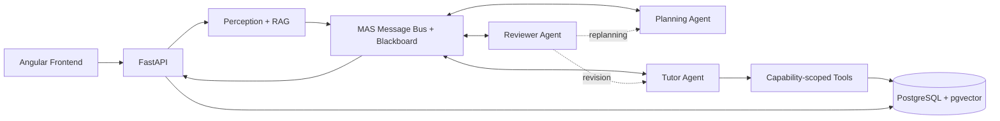

# StudyMummy

StudyMummy ist eine agentische Lernplattform. Sie verarbeitet eigene Lernmaterialien, führt Lernende adaptiv durch Aufgaben und hält Lernfortschritt, Fehlerbilder und Dokumentwissen über mehrere Sitzungen verfügbar.

Der Chat ist als hierarchisches, nachrichtengetriebenes Multi-Agent-System umgesetzt: Planning, Tutor und Reviewer besitzen getrennte Ziele, Capabilities und laufbezogene Zustände. Sie kommunizieren über typisierte Nachrichten; der Reviewer kann freigeben, eine toolfreie Tutorrevision verlangen oder den Planner anhand von Toolbeobachtungen neu planen lassen.

## Kernfunktionen

- Dokumentimport mit Text- und PDF-Verarbeitung
- Aufgaben-, Quiz- und Cheatsheet-Generierung
- adaptiver sokratischer Tutor mit vier Hilfestufen
- RAG über PostgreSQL und pgvector
- persistente Sitzungen, Dialoge und Lernprofile
- strukturierte Planung und kontrolliertes Tool-Calling
- Qualitätsprüfung jeder Tutorantwort
- Profile, Kalender, Social-Funktionen und Gamification

## Architektur



Eine detaillierte technische Beschreibung steht in [docs/architecture.md](docs/architecture.md). Die agentischen Eigenschaften und Abgrenzungen werden in [docs/agent-system.md](docs/agent-system.md) erläutert.

## Agenten-Workflow

Ein Chat-Turn startet mit fünf expliziten Phasen, kann aber über typisierte
Kritikpfade in die Ausführung oder Planung zurückspringen:

1. **Perceive:** Eingabe normalisieren, aktive Aufgabe und Dokumentkontext laden.
2. **Plan:** Absicht, nächste Aktion, Ziel, Erfolgskriterien und benötigte Tools bestimmen.
3. **Act:** Tutorantwort erzeugen und ausschließlich freigegebene Tools aufrufen.
4. **Review/Coordinate:** Antwort und Toolbeobachtungen prüfen; freigeben, Revision oder Neuplanung adressieren.
5. **Remember:** Antwort und ausgeführte Aktion im Sitzungsverlauf speichern.

Ein konfigurierbares Limit von eins bis vier Koordinationsrunden verhindert
Endlosschleifen. Die API gibt neben Tutorantwort und finalem Plan erfolgreiche
Tools, alle Toolstatus, Agentenschritte, sanitisierten Kommunikations-Trace,
lokale Agentenzustände und die Rundenzahl zurück. Volle Nachrichten-Payloads und
interne Gedankengänge werden nicht serialisiert.

## Technologie

| Bereich | Technologie |
|---|---|
| Frontend | Angular 22, TypeScript, PrimeNG, Tailwind CSS |
| Backend | Python 3.11+, FastAPI, Pydantic, SQLAlchemy |
| LLM | OpenAI-kompatible Chat-Completions mit JSON-Modus und Function Calling |
| Daten | PostgreSQL 15, pgvector |
| Betrieb | Docker Compose |
| Tests | pytest, pytest-asyncio, Vitest |

## Schnellstart mit Docker

1. `.env.example` nach `.env` kopieren und die Modellkonfiguration anpassen.
2. Entwicklungsumgebung mit Hot Reloading starten:

```bash
docker compose --profile dev up --build
```

Danach sind erreichbar:

- Frontend: `http://localhost:4200`
- API: `http://localhost:8000`
- OpenAPI-Dokumentation: `http://localhost:8000/docs`

Die PostgreSQL-Verbindung wird durch Docker Compose eingerichtet. Lokal verwendet das Beispiel Port `5433`, innerhalb des Compose-Netzes Port `5432`.

Produktiv werden Backend, Nginx-Frontend und Cloudflare Tunnel über das Produktionsprofil gestartet:

```bash
docker compose --profile prod up -d --build
```

Für einen neuen Linux-Server steht vorbereitend `scripts/setup_droplet.sh` zur Verfügung.

## Lokale Entwicklung

Backend:

```bash
cd backend
uv sync --extra dev
uv run uvicorn app.main:app --reload
uv run pytest -q
```

Frontend:

```bash
cd frontend
npm ci
npm start
npm test
```

## Verzeichnisstruktur

```text
backend/
  app/
    agents/          spezialisierte Agenten und Orchestrator
    api/             REST- und WebSocket-Endpunkte
    db/              SQLAlchemy-Modelle und Datenbankzugriff
    evaluation/      reproduzierbare Qualitätsmetriken
    models/          API- und Domänenmodelle
    services/        LLM, RAG, Dokumente und Sessions
    tools/           registrierte Agentenwerkzeuge
  tests/
frontend/
  src/app/
    core/            Authentifizierung, Layout und API-Services
    features/        fachliche UI-Bereiche
    shared/          wiederverwendbare Komponenten
docs/
  architecture.md
  agent-system.md
```

## Konfiguration

Die wichtigsten Umgebungsvariablen sind in `.env.example` dokumentiert:

- `OPENAI_API_KEY`, `OPENAI_BASE_URL`, `OPENAI_MODEL`
- `OPENAI_TEMPERATURE`, `OPENAI_TIMEOUT_SECONDS`
- `DATABASE_URL`
- `EMBEDDING_MODEL`
- `AGENT_REVIEW_ENABLED`
- `AGENT_MAX_COORDINATION_ROUNDS`
- `SECRET_KEY`

Für produktive Umgebungen müssen ein eigener `SECRET_KEY`, eingeschränkte CORS-Origins und sichere Datenbankzugänge gesetzt werden.

## Qualitätsprinzipien

- Agentenentscheidungen sind strukturierte Daten statt freier Prompt-Interpretation.
- Tool-Rechte werden nach der Planung durch eine feste Policy reduziert.
- Dokumentinhalte gelten als nicht vertrauenswürdige Daten.
- Side Effects laufen ausschließlich über registrierte Tools.
- Bei nicht verfügbarem JSON-Modus greifen deterministische Planungs-Fallbacks.
- Tests benötigen keinen Live-API-Key.
