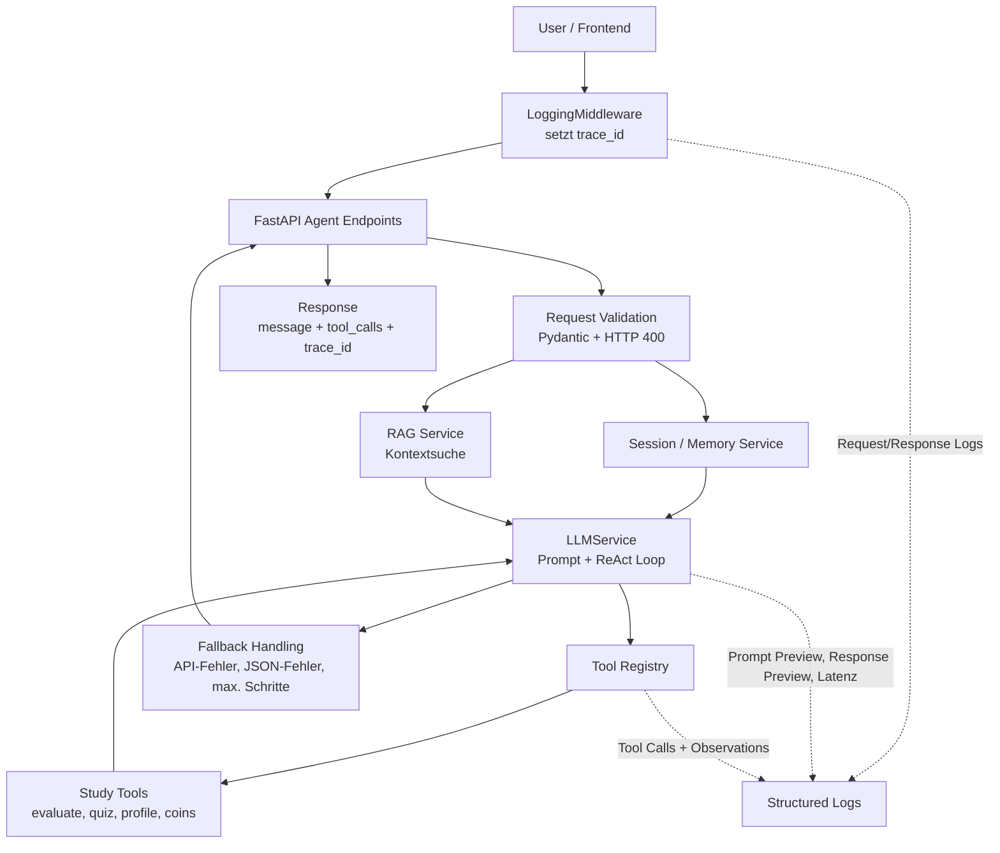

# Übungsblatt 01 – Projektdefinition & Agentenanalyse

## Projektname

**StudyMummy – Agentic AI Learning Platform**

## 1. Elevator Pitch

StudyMummy ist eine KI-gestützte Lernplattform für Schüler, Studierende, Auszubildende und Selbstlerner. Nutzer können Aufgabenblätter, PDFs, Screenshots oder andere Lernmaterialien hochladen und werden anschließend von einem intelligenten Tutor-Agenten Schritt für Schritt beim Verstehen und Lösen der Aufgaben unterstützt.

Im Gegensatz zu einem normalen Chatbot gibt StudyMummy nicht einfach sofort die Lösung aus. Der Agent analysiert die Aufgaben, erkennt Themen und Schwierigkeiten, stellt gezielte sokratische Fragen, bewertet Antworten, passt Hilfestellungen an den Lernstand an und entscheidet, wann Wiederholung oder ein Lernspiel sinnvoll ist. Zusätzlich erstellt StudyMummy am Ende einer Lerneinheit ein persönliches Cheatsheet und belohnt Lernfortschritt durch virtuelle Währung.

---

## 2. PEAS-Analyse

| PEAS-Komponente | Beschreibung für StudyMummy |
|---|---|
| **Performance Measure** | Erfolg erkennt man daran, dass Nutzer Aufgaben besser verstehen, Aufgaben korrekt lösen, weniger wiederholte Fehler machen, Schwächen gezielt verbessern und motiviert weiterlernen. Weitere Messgrößen sind gelöste Aufgaben, korrekte Antworten, Verbesserung des Confidence-Scores pro Thema, erfolgreich abgeschlossene Lernspiele, sinnvolle Cheatsheets und Nutzerzufriedenheit. |
| **Environment** | Die Umgebung besteht aus der Lernplattform, den hochgeladenen Lernmaterialien, den einzelnen Aufgaben, dem aktuellen Lernstand des Nutzers, den Interaktionen im Chat, den generierten Spielen, dem Game Tab und dem persönlichen Fortschrittsprofil. Außerdem gehören verschiedene Fächer wie Mathematik, Informatik, Englisch oder Naturwissenschaften zur Umgebung. |
| **Actuators** | Der Agent kann Aufgaben strukturieren, Hinweise geben, Rückfragen stellen, Erklärungen erzeugen, Antworten bewerten, Fehler markieren, Lernfortschritt aktualisieren, Wiederholungen empfehlen, Lernspiele starten, Quizfragen generieren, virtuelle Währung vergeben und Cheatsheets erstellen. |
| **Sensors** | Der Agent erhält Eingaben durch hochgeladene PDFs, Screenshots, Fotos, Word-Dokumente, Textaufgaben, Nutzerantworten, Chatnachrichten, ausgewählte Fächer, Aufgabenstatus, bisherige Fehler, Lernhistorie, Confidence-Werte und Spielergebnisse. |

---

## 3. Umgebungseigenschaften

| Dimension | Einordnung | Begründung |
|---|---|---|
| **Fully / Partially Observable** | **Partially observable** | Der Agent sieht zwar hochgeladene Aufgaben, Chatantworten und gespeicherte Lernfortschritte, aber er kennt nicht vollständig den tatsächlichen Wissensstand, die Motivation oder das Verständnis des Nutzers. Diese müssen aus den Antworten und Fehlern geschätzt werden. |
| **Deterministic / Stochastic** | **Stochastic** | Gleiche Aufgaben können bei verschiedenen Nutzern zu unterschiedlichen Antworten, Fehlern und Lernverläufen führen. Außerdem können LLM-Antworten variieren. Der Agent arbeitet daher mit Unsicherheit. |
| **Episodic / Sequential** | **Sequential** | Jede Interaktion beeinflusst spätere Entscheidungen. Wenn ein Nutzer zum Beispiel mehrfach Fehler bei linearen Funktionen macht, beeinflusst das zukünftige Hinweise, Wiederholungen, Quizfragen und Cheatsheet-Inhalte. |
| **Static / Dynamic** | **Dynamic** | Die Umgebung verändert sich während der Nutzung: Aufgabenstatus wechseln von „Open“ zu „Solved“ oder „Repeat“, Confidence-Werte verändern sich, neue Fehler werden erkannt und Spiele können neue Lernstände erzeugen. |
| **Discrete / Continuous** | **Überwiegend discrete, teilweise continuous** | Viele Elemente sind diskret, zum Beispiel Aufgaben, Antwortversuche, Statuswerte, Spielrunden und Quizfragen. Gleichzeitig gibt es kontinuierliche bzw. graduelle Werte wie Confidence-Scores, Fortschrittswerte oder Schwierigkeitsanpassungen. |
| **Single-Agent / Multi-Agent** | **Konzeptionell Multi-Agent, MVP eher orchestrierter Single-Agent** | Die Idee enthält mehrere spezialisierte Rollen wie Upload Analyzer Agent, Tutor Agent, Evaluation Agent, Learning Profile Agent, Progress Agent, Game Generator Agent und Cheatsheet Agent. Für das MVP kann dies zunächst als ein zentraler Agent mit mehreren Funktionen umgesetzt werden. |
| **Known / Unknown** | **Partially unknown** | Die grundlegenden Regeln der Plattform sind bekannt, zum Beispiel Upload, Aufgabenanalyse, Tutor-Chat und Quiz. Unbekannt sind jedoch die konkreten Inhalte der hochgeladenen Aufgaben, die Qualität der Nutzerantworten, individuelle Wissenslücken und mögliche Missverständnisse. |

---

## 4. Agententyp

StudyMummy kommt am nächsten an einen **Learning Agent** heran.

StudyMummy besitzt Merkmale mehrerer Agententypen:

| Agententyp | Bezug zu StudyMummy |
|---|---|
| **Simple Reflex Agent** | Teilweise bei einfachen Regeln, z. B. wenn eine Antwort leer ist, fordert der Agent eine neue Eingabe an. |
| **Model-Based Agent** | Der Agent nutzt ein internes Modell über Aufgabenstatus, Themen, Schwächen und Lernfortschritt. |
| **Goal-Based Agent** | Das Ziel ist, dass der Nutzer Aufgaben versteht, korrekt löst und Schwächen verbessert. |
| **Utility-Based Agent** | Der Agent kann zwischen verschiedenen nächsten Aktionen abwägen, z. B. weiterer Hinweis, neue Aufgabe, Wiederholung oder Spielmodus. |
| **Learning Agent** | Der Agent aktualisiert das Lernprofil anhand von Nutzerantworten und passt zukünftige Hilfen, Wiederholungen, Spiele und Cheatsheets daran an. |

**Begründung:**
StudyMummy ist ein Learning Agent, weil das System nicht nur einzelne Antworten erzeugt, sondern aus Nutzerinteraktionen ein Lernprofil ableitet. Dieses Profil beeinflusst spätere Entscheidungen, zum Beispiel welches Hilfeniveau gewählt wird, welche Themen wiederholt werden sollen, welche Quizfragen generiert werden und welche Inhalte im Cheatsheet besonders hervorgehoben werden.

---

# AUFGABE 2

---
# Übungsblatt 02 - Architekturentwurf: Die kognitiven Schichten

**Projektname:** StudyMummy - Agentic AI Learning Platform

**Leitfrage:** Wie nimmt StudyMummy die Welt wahr, was merkt sich der Agent, und wie entscheidet er?

StudyMummy ist eine KI-gestützte Lernplattform, bei der Nutzer Lernmaterialien hochladen und anschließend durch einen sokratischen Tutor-Agenten beim Verstehen und Lösen der Aufgaben unterstützt werden. Für den Architekturentwurf wird StudyMummy anhand der vier kognitiven Schichten Perception, Memory, Planning und Action betrachtet.

---

## 1. Schichten-Mapping

### 1.1 Perception - Wahrnehmung

Die Perception-Schicht ist dafür zuständig, alle relevanten Eingaben des Nutzers und der Plattform aufzunehmen und für die weitere Verarbeitung vorzubereiten.

#### Inputs

| Input                        | Beschreibung                                                        |
|-----------------------------|---------------------------------------------------------------------|
| PDF-Dateien                 | Hochgeladene Aufgabenblätter, Skripte oder Lernmaterialien         |
| Screenshots / Fotos         | Bilder von Aufgaben, Tafelbildern oder handschriftlichen Notizen   |
| Textdokumente / Word-Dateien| Strukturierte oder unstrukturierte Lernunterlagen                  |
| Direkte Texteingaben        | Antworten des Nutzers, Rückfragen, Notizen                         |
| Fachauswahl                 | Auswahl eines Fachs, z. B. Mathematik, Informatik oder Englisch    |
| Nutzerinteraktionen         | Klicks auf Aufgaben, Start eines Spiels, Auswahl eines Hilfeniveaus|
| Lernverlaufsdaten           | Bereits gelöste Aufgaben, falsche Antworten, Spielresultate        |

#### Vorverarbeitung

- Textextraktion aus PDFs
- OCR für Screenshots und Fotos
- Aufteilung des Materials in einzelne Aufgaben
- Erkennung von Fach, Thema und Schwierigkeit
- Extraktion wichtiger Formeln, Begriffe und Methoden
- Umwandlung der Inhalte in ein strukturiertes Aufgabenformat
- Erkennung des aktuellen Aufgabenstatus
- Normalisierung von Nutzerantworten für die Bewertung

---

### 1.2 Memory - Gedächtnis

#### Working Memory / Kurzzeitgedächtnis

| Inhalt                  | Beispiel                                                    |
|------------------------|-------------------------------------------------------------|
| Aktuelle Aufgabe       | Der Nutzer bearbeitet Aufgabe 2 zu linearen Funktionen      |
| Aktuelle Nutzerantwort | „x = 1.5"                                                   |
| Aktuelles Hilfeniveau  | Level 2: spezifische Hilfestellung                          |
| Aktueller Dialogverlauf| Bisherige Fragen und Antworten innerhalb der Aufgabe        |
| Zwischenschritte       | Bisher erkannte Rechenwege oder Fehler                      |

#### Episodic Memory / Ereignisgedächtnis

| Inhalt               | Beispiel                                                    |
|---------------------|-------------------------------------------------------------|
| Bearbeitete Aufgaben| Aufgabe 1 wurde gelöst, Aufgabe 2 war fehlerhaft            |
| Fehlerhistorie      | Der Nutzer macht wiederholt Vorzeichenfehler                |
| Spielverlauf        | Quiz Show Runde mit 3 von 5 richtigen Antworten             |
| Tutorverlauf        | Bei Gleichungen wurde mehrfach Hilfestufe 3 benötigt        |
| Session-Historie    | Letzte Sitzung: Thema „quadratische Funktionen"             |

#### Semantic Memory / Wissensgedächtnis

| Inhalt             | Beispiel                                                        |
|-------------------|-----------------------------------------------------------------|
| Fachwissen        | Mathematische Regeln, Grammatikregeln, Programmierkonzepte      |
| Formeln           | f(x) = mx + b, pq-Formel, Ohmsches Gesetz                       |
| Methoden          | Gleichungen umstellen, Textanalyse, Debugging                   |
| Aufgabentypen     | Nullstellen bestimmen, Code erklären, Vokabeln abfragen         |
| Erklärstrategien  | Sokratische Fragen, Beispiele, typische Fehler                  |

#### Wo reicht das Context Window?

Das Context Window reicht für:
- einzelne kurze Aufgaben
- den aktuellen Chatverlauf
- direkte Rückfragen
- kurze Erklärungen
- einfache Quizrunden

Es reicht **nicht** für:
- vollständige Lernhistorien über mehrere Sitzungen
- langfristige Schwächenanalyse
- viele hochgeladene Dokumente / große PDFs
- Wiederholung alter Fehler
- personalisierte Cheatsheets über mehrere Themen hinweg

---

### 1.3 Planning - Planung und Entscheidung

#### Reaktive Entscheidungen

| Situation                         | Reaktion                                                    |
|----------------------------------|-------------------------------------------------------------|
| Nutzer gibt keine Antwort        | Agent fragt nach oder gibt einen kleinen Hinweis            |
| Antwort ist offensichtlich falsch| Agent gibt Feedback und eine Hilfestellung                  |
| Nutzer fragt nach Lösung         | Agent gibt zunächst einen Hinweis statt direkt die Lösung   |
| Aufgabe wurde gelöst             | Status wird auf „solved" gesetzt                            |
| Nutzer wählt Game Tab            | Quizmodus wird gestartet                                    |

#### Deliberative Entscheidungen

| Entscheidung                              | Benötigte Informationen                                 |
|------------------------------------------|---------------------------------------------------------|
| Welches Hilfeniveau ist passend?         | Aufgabe, Fehlerhistorie, bisherige Antworten            |
| Soll die Aufgabe wiederholt werden?      | Anzahl Fehler, Confidence-Wert, Schwierigkeit           |
| Soll ein Lernspiel vorgeschlagen werden? | Lernphase, Motivation, Fehlerhäufigkeit                 |
| Welche Quizfragen sollen generiert werden?| Schwächen, Themen, bisherige Aufgaben                  |
| Was gehört ins Cheatsheet?               | Gelöste Aufgaben, typische Fehler, zentrale Konzepte    |
| Welche Aufgabe sollte als Nächstes kommen?| Reihenfolge, Schwierigkeit, Lernstand                  |

#### Braucht StudyMummy hierarchische Pläne?

Ja, zumindest einfache hierarchische Pläne sind sinnvoll.

**Beispiel für einen hierarchischen Lernplan:**

1. Arbeitsblatt analysieren
2. Aufgaben strukturieren
3. Aufgabe auswählen
4. Nutzer durch Aufgabe führen
5. Antwort bewerten
6. Lernprofil aktualisieren
7. Entscheiden: nächste Aufgabe, Wiederholung, Lernspiel oder Cheatsheet
8. Am Ende Zusammenfassung erzeugen

Innerhalb einer einzelnen Aufgabe kann der Tutor-Agent zusätzlich einen kleineren Plan verfolgen: Aufgabenverständnis prüfen, relevante Formel oder Methode erfragen, ersten Lösungsschritt begleiten, Zwischenergebnis prüfen, Endergebnis bewerten und Fehler erklären oder Aufgabe abschließen.

---

### 1.4 Action - Handlung

| Aktion                      | Beschreibung                                                                  |
|----------------------------|-------------------------------------------------------------------------------|
| Aufgaben extrahieren       | Der Agent strukturiert das hochgeladene Material in einzelne Aufgaben         |
| Aufgaben klassifizieren    | Fach, Thema, Schwierigkeit und benötigte Konzepte werden erkannt              |
| Sokratische Fragen stellen | Der Agent stellt gezielte Rückfragen statt direkt die Lösung zu geben         |
| Hinweise geben             | Je nach Hilfeniveau gibt der Agent kleine oder konkrete Hilfen                |
| Antworten bewerten         | Nutzerantworten werden als korrekt, teilweise korrekt oder falsch bewertet    |
| Fehler erklären            | Der Agent erkennt typische Fehler und erklärt sie verständlich                |
| Lernprofil aktualisieren   | Confidence-Werte und Schwächen werden gespeichert                             |
| Aufgabenstatus ändern      | Aufgaben werden auf „open", „in progress", „solved", „repeat" usw. gesetzt   |
| Lernspiel generieren       | Der Agent erstellt Quizfragen passend zum aktuellen Lernstand                 |
| Virtuelle Währung vergeben | Nutzer erhalten Belohnungen für richtige Antworten oder abgeschlossene Spiele |
| Cheatsheet erstellen       | Der Agent erzeugt eine persönliche Zusammenfassung nach der Lerneinheit       |

#### Aktionen mit Seiteneffekten

| Aktion                      | Seiteneffekt                                              |
|----------------------------|-----------------------------------------------------------|
| Lernprofil aktualisieren   | Dauerhafte Veränderung des Nutzerprofils                  |
| Virtuelle Währung vergeben | Veränderung des Kontostands innerhalb der Plattform       |
| Aufgabenstatus ändern      | Veränderung des Fortschritts im Arbeitsblatt              |
| Cheatsheet speichern       | Neues dauerhaftes Dokument entsteht                       |
| Spielhistorie speichern    | Fortschritt im Game Tab verändert sich                    |
| Joker kaufen oder einsetzen| Virtuelle Währung und Spielzustand verändern sich         |

---

## 2. Architekturdiagramm


---

## 3. Kritische Schichten und größte Herausforderungen

### Kritische Schicht 1: Perception

- Aufgaben korrekt voneinander trennen
- Handschriftliche oder schlecht lesbare Inhalte erkennen
- Fach und Thema zuverlässig bestimmen
- Formeln korrekt extrahieren
- Tabellen, Diagramme oder Bilder interpretieren

### Kritische Schicht 2: Memory

- Sinnvolle Confidence-Werte berechnen
- Alte Fehler nicht vergessen
- Irrelevante Informationen nicht dauerhaft speichern
- Aktuelle Aufgabe und langfristigen Lernstand sauber trennen
- Lernprofil über mehrere Sitzungen hinweg konsistent halten

### Kritische Schicht 3: Planning

- Nicht zu schnell die Lösung verraten
- Passende Hilfestufe wählen
- Sinnvolle Wiederholungen vorschlagen
- Lernspiele nicht zu früh oder zu spät starten
- Zwischen Motivation und echtem Lernen balancieren
- Game-Mechaniken nicht wichtiger machen als Lernfortschritt

---

## 4. Identifizierte Schwäche im Entwurf

**Die aktuell schwächste Schicht ist Perception, besonders bei komplexen oder schlecht strukturierten Uploads.**

StudyMummy hängt stark davon ab, dass hochgeladene Materialien korrekt verstanden werden. Bei klaren Text-PDFs ist das relativ gut lösbar. Schwieriger wird es bei:

- Fotos von Arbeitsblättern
- Handschriftlichen Notizen
- Mathematischen Formeln
- Mehrspaltigen PDFs
- Diagrammen und Tabellen
- Aufgaben mit mehreren Teilaufgaben
- Unklaren Aufgabenstellungen

Wenn der Agent bereits bei der Extraktion Fehler macht, können alle weiteren Schichten falsche Entscheidungen treffen. Eine falsch erkannte Aufgabe führt zu falscher Tutorunterstützung, falschen Quizfragen und einem unbrauchbaren Cheatsheet.

### Was fehlt noch?

- Validierung der erkannten Aufgaben
- Möglichkeit für Nutzer, erkannte Aufgaben zu korrigieren
- Konfidenzwerte für die Extraktion
- Vorschau der erkannten Aufgaben vor dem Start
- Manuelle Nachbearbeitung von Thema, Fach und Schwierigkeit
- Bessere Unterstützung für Formeln und handschriftliche Inhalte

---

## 5. Technologie-Vorauswahl

| Schicht / Baustein                   | Mögliche Technologie                                              |
|-------------------------------------|-------------------------------------------------------------------|
| Perception: PDF-Upload              | Frontend mit File Upload                                      |
| Perception: PDF-Textextraktion      | PyMuPDF, pdfplumber oder LangChain Document Loader               |
| Perception: OCR für Bilder          | Tesseract OCR, Google Vision API oder visionfähiges LLM          |
| Perception: Dokumentanalyse         | LLM mit Structured Output                                         |
| Perception: Aufgabenstrukturierung  | JSON Schema / Pydantic Models                                     |
| Memory: Working Memory              | LLM Context Window / Session State                               |
| Memory: Nutzerprofil                | PostgreSQL, Firebase Firestore oder Supabase                     |
| Memory: Semantic Memory             | Vector Store, z. B. Chroma, FAISS oder pgvector                  |
| Planning: Agenten-Orchestrierung    | LangGraph oder eigener Orchestrator                              |
| Planning: Entscheidungslogik        | Kombination aus Regeln und LLM-Entscheidungen                    |
| Planning: Structured Decisions      | JSON Output / Function Calling                                    |
| Action: Tutorantworten              | LLM API                                                           |
| Action: Antwortbewertung            | LLM + Regelprüfungen                                             |
| Action: Quizgenerierung             | LLM mit JSON Schema                                               |
| Action: Cheatsheet-Erstellung       | LLM + gespeicherte Sessiondaten                                  |
| Action: virtuelle Währung           | Backend-Service mit Datenbankupdate                              |
| Frontend                            | Flutter                                                          |
| Backend                             | FastAPI                                                          |
| Authentifizierung                   | Firebase Auth, Supabase Auth oder Auth.js                        |
| Dateiablage                         | Supabase Storage, Firebase Storage oder S3                       |
| Deployment                          | Vercel für Frontend, Render/Fly.io/Railway für Backend           |

---

## 6. Offene Fragen für den nächsten Termin: LLMs, RAG & Tool Use

| Bereich           | Offene Fragen                                                                                                                              |
|------------------|--------------------------------------------------------------------------------------------------------------------------------------------|
| Structured Output| Wie erzwingen wir zuverlässige JSON-Ausgaben für Aufgabenanalyse, Quizfragen und Cheatsheets? Wie gehen wir mit ungültigen LLM-Antworten um? |
| RAG              | Welche Inhalte sollen in einen Vector Store? Nur hochgeladene Materialien oder auch allgemeine Lerninhalte?                                |
| Tool Use         | Welche Tools braucht der Agent zuerst? Mögliche Tools: `extract_tasks_from_document`, `evaluate_answer`, `update_learning_profile`, `generate_quiz_questions`, `create_cheatsheet` |
| Memory           | Wie werden Confidence-Werte berechnet? Wie lange sollen Lernverläufe gespeichert werden?                                                  |
| Sicherheit       | Wie verhindern wir, dass der Agent sofort komplette Lösungen ausgibt, obwohl sokratisches Lernen gewünscht ist?                           |
| MVP-Einschränkung| Starten wir zuerst nur mit Mathematik? Unterstützen wir zuerst nur Text/PDF statt Fotos und Handschrift?                                 |


# StudyMummy – Implementierungsdokumentation

**Übungsblatt 03: Erste Implementierung – LLM, RAG & Tool Use**
WP Agentic AI | HAW Hamburg | SS 2026

---

## Überblick

Dieses Dokument beschreibt die Implementierung der drei Meilensteine aus Übungsblatt 03. Das Ziel war es, das StudyMummy-System vom Architekturentwurf (Übungsblatt 02) in einen lauffähigen Prototypen zu überführen: mit LLM-Anbindung, Tool Use via Function Calling und einem RAG-Grundgerüst für die Retrieval-Pipeline.

---

## Meilenstein 1 – LLM-Anbindung & Grundgerüst

### Entwicklungsumgebung

Das Projekt wurde als Python-Package mit `pyproject.toml` aufgesetzt und verwendet `uv` als Package-Manager. Die Abhängigkeiten sind in zwei Gruppen unterteilt: Basis-Dependencies und optionale RAG-Erweiterungen.

**Verwendeter Tech-Stack:**

| Komponente | Technologie | Begründung |
|---|---|---|
| Web-Framework | FastAPI 0.115+ | Async-native, automatische OpenAPI-Docs, Pydantic-Integration |
| LLM-Provider | OpenAI (`gpt-4o-mini`) | Supports Function Calling, günstig für Prototyp |
| Konfiguration | Pydantic Settings | Typsichere Env-Variablen, `.env`-Support |
| Laufzeitumgebung | Python 3.11+ | `asyncio`-native, `match`-Statement |
| Build-System | Hatchling | Leichtgewichtig, kein `setup.py` nötig |

```
pyproject.toml  →  [tool.hatch.build.targets.wheel]
                    packages = ["app"]
```

> **Hinweis:** Hatchling sucht standardmäßig nach einem Verzeichnis mit demselben Namen wie das Projekt. Da das Package-Verzeichnis `app/` heißt (nicht `studymummy/`), muss der Pfad explizit konfiguriert werden.

### System Prompt – Sokratisches Prinzip

Der Agent erhält einen festen System Prompt, der das sokratische Lehrprinzip implementiert: Rückfragen statt direkter Lösungen, dynamisches Hilfeniveau (Level 1–3), Motivationssprache und automatisches Lernprofil-Update.

```python
# app/services/llm_service.py
SOCRATIC_SYSTEM_PROMPT = """Du bist StudyMummy, ein sokratischer Tutor-Agent.
Gib NIEMALS direkt die Lösung, wenn der Nutzer noch nicht nachgedacht hat.
Hilfeniveau: Level 1 = Hinweis, Level 2 = Teilanleitung, Level 3 = Musterlösung."""
```

### Grenzen des reinen LLM-Calls

Ein erster Test ohne Tools zeigt die typischen Einschränkungen:

- **Fehlende Persistenz:** Das Modell kennt keinen Lernfortschritt aus vorherigen Sitzungen.
- **Keine Aktionen:** Der Agent kann keine Lernprofile aktualisieren oder Coins vergeben.
- **Kontextgröße:** Lange Arbeitsblätter überschreiten das Context Window.
- **Halluziniertes Fachwissen:** Domänenspezifische Formeln sind nicht zuverlässig korrekt.

---

## Meilenstein 2 – Tool Use: Die erste Lücke schließen

### Entscheidung: Tool Use (Option B) zuerst

Die Entscheidung fiel auf **Tool Use** statt RAG, weil die Agent-Action-Schicht (Lernprofil-Updates, Bewertung, Gamification) für den sokratischen Tutor-Loop unmittelbarer notwendig ist als semantische Suche. RAG wurde als Grundgerüst vorbereitet und kann in Meilenstein 3 vollständig integriert werden.

### Tool-Registry

Ein zentrales Registry-Pattern entkoppelt die Tools vollständig von der LLM-Logik. Neue Tools lassen sich registrieren, ohne die Agent-Orchestrierung zu ändern:

```python
# app/tools/registry.py
@dataclass
class ToolDefinition:
    name: str
    description: str
    parameters: dict   # JSON Schema
    fn: ToolFn         # async Callable

def register(tool: ToolDefinition) -> ToolDefinition:
    _REGISTRY[tool.name] = tool
    return tool

def as_openai_tools() -> list[dict]:
    """Gibt alle registrierten Tools im OpenAI Function-Calling-Format zurück."""
    ...
```

### Implementierte Tools (Mock-Implementierungen)

Alle fünf Tools sind als Mock-Funktionen implementiert, die sofort per Function Calling aufrufbar sind. Die echte Geschäftslogik kann schrittweise eingebaut werden.

| Tool | Schicht | Beschreibung | Seiteneffekte |
|---|---|---|---|
| `evaluate_answer` | Action | Bewertet Nutzerantwort (korrekt / falsch) | Nein |
| `update_learning_profile` | Action | Speichert Confidence-Wert pro Thema | Ja – Nutzerprofil |
| `generate_quiz_questions` | Action | Erstellt Multiple-Choice-Fragen | Nein |
| `create_cheatsheet` | Action | Erzeugt persönliches Cheatsheet | Ja – neues Dokument |
| `award_coins` | Action | Vergibt virtuelle Währung | Ja – Kontostand |

> **Sicherheitshinweis (Übungsblatt 06-Vorbereitung):** Tools mit Seiteneffekten (`update_learning_profile`, `create_cheatsheet`, `award_coins`) werden in der Fehlerbehandlung besonders behandelt. Fehler werden geloggt und geben strukturierte Error-Responses zurück, anstatt Exceptions zu werfen.

### ReAct-Loop (Thought → Action → Observation)

Der LLM-Service implementiert den ReAct-Loop mit einem Guardrail bei maximal 5 Iterationen:

```python
# app/services/llm_service.py – vereinfacht
for _ in range(5):                        # Guardrail: max 5 Iterationen
    response = await openai.chat(...)
    if not response.tool_calls:
        return response.content           # Thought → fertig
    for tc in response.tool_calls:        # Action
        result = await execute_tool(tc)   # Observation
        messages.append(tool_result)      # zurück in den Loop
```

**Ablauf am Beispiel:**
1. Nutzer: *„Ich verstehe die Nullstelle nicht"*
2. LLM denkt nach (Thought) → ruft `evaluate_answer` auf (Action)
3. Tool gibt `{"is_correct": false, "feedback": "..."}` zurück (Observation)
4. LLM formuliert sokratische Rückfrage basierend auf dem Feedback
5. Falls korrekt: `award_coins` + `update_learning_profile` werden ausgelöst

### RAG-Grundgerüst

Parallel zu Tool Use wurde ein RAG-Service als In-Memory-Grundgerüst implementiert:

```python
# app/services/rag_service.py
class RAGService:
    def add_document(self, doc_id, text, metadata): ...
    def retrieve(self, query, top_k=3) -> str: ...  # Mock: gibt erste k Dokumente zurück
```

Der RAG-Kontext wird bei jedem Chat-Call als zweite System-Message an das LLM übergeben. Der Austausch gegen ChromaDB (echtes Embedding-Retrieval) erfordert nur eine Änderung in `rag_service.py`, ohne die API-Schicht zu berühren.

---

## Meilenstein 3 – Erster End-to-End-Durchlauf

### API-Endpunkte

Das Backend stellt folgende Endpunkte unter `/api/v1` bereit:

| Methode | Pfad | Beschreibung | Kognitive Schicht |
|---|---|---|---|
| `POST` | `/agent/chat` | Sokratischer Tutor-Chat mit Tool Use | Planning + Action |
| `POST` | `/agent/upload` | Dokument hochladen & Aufgaben extrahieren | Perception |
| `POST` | `/agent/quiz` | Quiz zu einem Thema generieren | Action |
| `POST` | `/agent/cheatsheet` | Personalisiertes Cheatsheet erstellen | Action |
| `GET` | `/memory/session/{id}` | Working Memory einer Session | Memory |
| `GET` | `/memory/profile/{id}` | Lernprofil eines Nutzers | Memory |
| `POST/GET/PATCH/DELETE` | `/tasks/` | Task-CRUD | Perception-Output |
| `GET` | `/health` | Systemstatus | – |

### Vollständiger Durchlauf

**Schritt 1 – Dokument hochladen (Perception)**

```bash
curl -X POST http://localhost:8000/api/v1/agent/upload \
  -F "file=@aufgabenblatt.txt"
```

Rückgabe: strukturiertes JSON mit extrahierten Tasks (task_id, subject, topic, difficulty, required_concepts, status: "open") – identisch mit dem internen Aufgabenformat aus Übungsblatt 02.

**Schritt 2 – Chat starten (Planning + Action)**

```bash
curl -X POST http://localhost:8000/api/v1/agent/chat \
  -H "Content-Type: application/json" \
  -d '{
    "session_id": "sess_001",
    "user_id": "student_42",
    "message": "Was ist eine Nullstelle?",
    "task_id": "task_01"
  }'
```

Rückgabe:
```json
{
  "session_id": "sess_001",
  "message": "Gute Frage! Was denkst du: Wo schneidet ein Graph die x-Achse?",
  "action_taken": "evaluate_answer",
  "tool_calls": ["evaluate_answer"],
  "trace_id": "a3f9b1c2"
}
```

**Schritt 3 – Lernprofil prüfen (Memory)**

```bash
curl http://localhost:8000/api/v1/memory/profile/student_42
```

### Was funktioniert / Was bricht

| Aspekt | Status | Anmerkung |
|---|---|---|
| LLM-Call mit System Prompt | ✅ Funktioniert | Sokratische Antworten wie erwartet |
| Tool Use (Function Calling) | ✅ Funktioniert | Mock-Rückgaben korrekt in Loop eingebaut |
| Dokument-Upload & Task-Extraktion | ✅ Funktioniert | Nur Plain-Text/UTF-8; kein PDF-Parsing |
| Working Memory (Dialog-History) | ✅ Funktioniert | In-Memory, max. 20 Turns |
| RAG-Retrieval | ⚠️ Mock | Kein echtes Embedding, nur sequentielle Ausgabe |
| Lernprofil-Persistenz | ⚠️ In-Memory | Geht beim Neustart verloren |
| PDF-Parsing (PyMuPDF) | ❌ Nicht implementiert | Dependency vorbereitet in `pyproject.toml` |
| Echte Similarity-Suche | ❌ Nicht implementiert | ChromaDB-Anbindung als nächster Ausbau |

---

# Übungsblatt 04 - Architektur skalieren: Multi-Agent oder Vertiefung


## Meilenstein 1 - Architekturentscheidung

### Entscheidung: Pfad B - Vertiefung statt Multi-Agent

StudyMummy bleibt im aktuellen MVP ein **orchestrierter Single-Agent mit Tool Use, RAG-Kontext und ReAct-Loop**. Wir entscheiden uns bewusst gegen eine sofortige Multi-Agent-Architektur, weil der wichtigste Nutzerfluss - eine Lernaufgabe verstehen, Schritt für Schritt begleiten, Antwort bewerten und Lernprofil aktualisieren - stark sequenziell ist.

Ein Multi-Agent-System wäre fachlich möglich, z. B. mit Upload Analyzer, Tutor Agent, Evaluation Agent, Progress Agent und Quiz Agent. Für den aktuellen Stand würde diese Aufteilung aber mehr Koordinationsaufwand erzeugen als Nutzen bringen. Die zentrale Herausforderung liegt nicht im parallelen Durchsatz, sondern in Robustheit, nachvollziehbaren Entscheidungen und sauberem Umgang mit fehlerhaften Eingaben.

### Heuristik aus der Vorlesung

| Frage | Bewertung für StudyMummy | Konsequenz |
|---|---|---|
| Gibt es unabhängige Teilaufgaben? | Teilweise. Upload-Analyse, Bewertung, Quiz und Cheatsheet lassen sich fachlich trennen. | Perspektivisch ja, aber für das MVP reicht ein zentraler Agent mit klaren Tools. |
| Profitieren die Teilaufgaben von Spezialisierung? | Ja, besonders bei Perception, Evaluation und Lernprofil. | Spezialisierte Worker bleiben eine sinnvolle Ausbaustufe. |
| Erhöht Parallelisierung den Durchsatz? | Nur begrenzt. Der Tutor-Dialog ist schrittweise und abhängig vom aktuellen Nutzerzustand. | Parallelisierung ist aktuell weniger wichtig als korrekte Sequenz und Kontexttreue. |
| Ist Shared State beherrschbar? | Noch nicht vollständig. Sessions, Profile und RAG laufen im MVP nur in-memory. | Erst Persistenz und Tracing stabilisieren, dann Multi-Agent-Koordination. |
| Ist die Fehleranalyse im Single-Agent-Modus noch nachvollziehbar? | Ja. Tool Calls, `trace_id` und ReAct-Schritte sind zentral sichtbar. | Single-Agent erleichtert Debugging und Evaluation im aktuellen Stadium. |

**Begründung:**
StudyMummy soll Lernende nicht einfach mit vielen parallel arbeitenden Agenten beeindrucken, sondern zuverlässig tutorieren. Der sinnvollste nächste Schritt ist deshalb die Vertiefung der vorhandenen Architektur: RAG-Kontext, Tool Use, ReAct-Loop, Observability und Fehlerbehandlung werden so dokumentiert und ausgebaut, dass das System ungewöhnliche Eingaben besser überlebt.

---

## Meilenstein 2 - Vertiefte Implementierung

### Geschlossene zweite Lücke: RAG + Tool Use im selben Agentenfluss

Der Agent kombiniert jetzt **RAG-Kontext** mit **Tool Use** in einem gemeinsamen Chat-Ablauf.

Der Ablauf ist:

1. Nutzer sendet eine Chatnachricht an `/api/v1/agent/chat`.
2. Das Working Memory wird über `session_id` geladen.
3. Der RAG-Service sucht passenden Kontext zur Nachricht.
4. Der LLM-Service baut System Prompt, optionalen RAG-Kontext und Dialoghistorie zusammen.
5. Der ReAct-Loop entscheidet, ob Tools aufgerufen werden.
6. Tool-Ergebnisse werden als Observation zurück in den LLM-Kontext gegeben.
7. Die finale Tutorantwort wird gespeichert und mit `trace_id` zurückgegeben.

### ReAct-Pattern

Das ReAct-Pattern ist im `LLMService` umgesetzt:

| ReAct-Schritt | Umsetzung im Projekt |
|---|---|
| Thought | Das LLM bewertet die aktuelle Nachricht im Kontext des sokratischen System Prompts. |
| Action | Das LLM kann registrierte Tools wie `evaluate_answer`, `update_learning_profile`, `generate_quiz_questions`, `create_cheatsheet` oder `award_coins` aufrufen. |
| Observation | Tool-Ergebnisse werden als `tool`-Message zurück in den Chat-Kontext eingefügt. |
| Guardrail | Maximal 5 Iterationen verhindern Endlosschleifen. |

### Neues Feature: Robustheits- und Observability-Vertiefung

Für Termin 4 wurde nicht ein komplett neuer Agent eingeführt, sondern die vorhandene Agentenarchitektur robuster gemacht:

- LLM-Aufrufe loggen Start, Response-Vorschau, Tool-Call-Anzahl und Latenz.
- API-Ausfälle des LLM führen zu einer verständlichen Fallback-Antwort statt zu einem ungefangenen Fehler.
- Ungültige Tool-Argumente werden abgefangen und als strukturierte Observation an den ReAct-Loop zurückgegeben.
- Task-Extraktion gibt bei API- oder JSON-Fehlern eine leere Aufgabenliste zurück statt den Upload-Flow hart abbrechen zu lassen.
- Leere Upload-Dateien und Dateien ohne auswertbaren Text werden mit HTTP 400 abgefangen.

---

## Observability-Setup

StudyMummy nutzt eine requestweite `trace_id`, um Chatdurchläufe nachvollziehbar zu machen. Diese ID wird in Logs, Response-Headern und Chat-Responses sichtbar.

| Observability-Aspekt | Umsetzung |
|---|---|
| Request-Tracing | `LoggingMiddleware` setzt pro Request eine neue `trace_id`. |
| LLM-Start | Loggt Modellaufruf, Nachrichtenanzahl und ob RAG-Kontext vorhanden ist. |
| LLM-Response | Loggt Latenz, Anzahl der Tool Calls und eine kurze Response-Vorschau. |
| Tool Calls | Jeder Tool-Aufruf wird mit Funktionsname und Argumenten geloggt. |
| Fehler | API-Fehler, Tool-Fehler und JSON-Parsing-Fehler werden mit derselben `trace_id` geloggt. |
| Frontend-Korrelation | `X-Trace-Id` im Response-Header verbindet Frontend- und Backend-Beobachtungen. |

Beispielhafter Trace:

```text
2026-06-02 14:10:01 [INFO] trace=a3f9b1c2 app.services.llm_service: [a3f9b1c2] LLM call started, messages=3, extra_context=True
2026-06-02 14:10:02 [INFO] trace=a3f9b1c2 app.services.llm_service: [a3f9b1c2] LLM response received in 842.4ms, tool_calls=1, response_preview='...'
2026-06-02 14:10:02 [INFO] trace=a3f9b1c2 app.services.llm_service: [a3f9b1c2] Tool call: evaluate_answer(...)
2026-06-02 14:10:03 [INFO] trace=a3f9b1c2 app.services.llm_service: [a3f9b1c2] LLM finished after 1320.7ms, tools_called=['evaluate_answer']
```

---

## Edge Cases und Failure Modes

| Failure Mode | Erwartetes Verhalten | Tatsächliches Verhalten im aktuellen Stand | Lösungsansatz |
|---|---|---|---|
| Leere Chatnachricht | Agent soll nicht halluzinieren, sondern nach einer konkreten Frage oder Aufgabe fragen. | Noch nicht vollständig validiert; leere Strings können an das LLM weitergegeben werden. | Für Termin 5: Validierung in `ChatRequest` ergänzen, z. B. Mindestlänge und Trim-Prüfung. |
| Leerer Upload | Upload soll abgelehnt werden. | Implementiert: leere Datei ergibt HTTP 400. | `agent.upload_document` prüft `content` vor Decoding. |
| Upload ohne auswertbaren Text | Agent soll keine erfundenen Aufgaben extrahieren. | Implementiert: Whitespace-only-Dateien ergeben HTTP 400. | Text wird nach Decoding mit `text.strip()` geprüft. |
| LLM/API-Ausfall | Nutzer soll eine verständliche Fallback-Antwort erhalten; Logs sollen den Fehler enthalten. | Implementiert im Chat- und Task-Extraktionspfad. | `LLMService` fängt API-Fehler ab, loggt Latenz und Fehler, gibt Fallback zurück. |
| Ungültiges JSON bei Task-Extraktion | Keine Exception bis zum Nutzer durchreichen. | Implementiert: ungültiges JSON ergibt leere Aufgabenliste. | JSON-Parsing wird abgefangen und mit `trace_id` geloggt. |
| Ungültige Tool-Argumente | ReAct-Loop soll nicht abbrechen. | Implementiert: Fehler wird als Tool-Observation zurückgegeben. | `json.JSONDecodeError` bei Tool-Arguments wird abgefangen. |
| Unbekanntes Tool | Agent soll keine Anwendungsexception erzeugen. | Implementiert: Registry-Fehler wird als `{"error": ...}` zurückgegeben. | `KeyError` beim Tool Lookup wird abgefangen. |
| ReAct-Endlosschleife | Agent soll begrenzt abbrechen. | Implementiert: maximal 5 Iterationen. | Guardrail im `LLMService`. |
| Kein RAG-Kontext vorhanden | Chat soll trotzdem funktionieren. | Implementiert: leerer Kontext wird nicht als zusätzliche System Message gesendet. | `extra_context=context or None`. |

### Priorisierte Robustheitslücken

| Priorität | Lücke | Warum wichtig? |
|---|---|---|
| Hoch | Validierung leerer Chatnachrichten | Verhindert unnötige LLM-Kosten und unklare Antworten. |
| Hoch | Echtes PDF-Parsing statt Text-Decoding | Uploads sind ein Kernfeature; reine Textdateien reichen nicht für echte Arbeitsblätter. |
| Mittel | Echtes Embedding-Retrieval | Der aktuelle RAG-Service liefert noch keine semantisch besten Treffer. |
| Mittel | Persistente Sessions | Lernprofile gehen beim Neustart verloren. |
| Niedrig | Multi-Agent-Orchestrierung | Erst sinnvoll, wenn Persistenz, Evaluation und Guardrails stabiler sind. |

---

## Feedback-Notizen und Prioritäten

| Feedback-/Review-Punkt | Priorität | Konsequenz für Termin 5/6 |
|---|---|---|
| Architekturentscheidung muss klar begründet sein. | Hoch | Pfad B wird dokumentiert: Vertiefung statt Multi-Agent. |
| Das System braucht nachvollziehbare Traces. | Hoch | `trace_id`, LLM-Latenz, Response-Vorschau und Tool Calls werden geloggt. |
| Upload-Verhalten ist noch zu schwach für echte PDFs. | Hoch | PyMuPDF/PDF-Parsing als nächster technischer Schwerpunkt. |
| RAG ist bisher nur Mock-Retrieval. | Mittel | ChromaDB oder pgvector für echte Similarity-Suche vorbereiten. |
| Tests müssen nicht exakte Antworten prüfen, sondern Verhalten. | Hoch | Termin 5: semantische Tests für Tool Calls, Edge Cases und Antwortstruktur. |
| Guardrails gegen direkte Lösungsausgabe fehlen noch. | Hoch | Termin 6: Output-Monitoring und Tutor-Scope-Regeln ergänzen. |

**Kurzfazit Termin 4:**
StudyMummy bleibt bewusst ein Single-Agent-System mit vertiefter Tool-/RAG-Integration. Die Entscheidung ist für das MVP sinnvoll, weil der Tutor-Dialog sequenziell ist und die größten Risiken aktuell in Robustheit, Observability, Perception und Persistenz liegen. Multi-Agent bleibt als spätere Skalierungsoption erhalten, sobald die Kernflüsse stabil und messbar sind.

---

# Übungsblatt 05 - Engineering: Robustheit, Testing & Observability


## Meilenstein 1 - Fehlerbehandlung

### Identifizierte Failure Modes

| Failure Mode | Risiko | Implementierte Reaktion | Teststatus |
|---|---|---|---|
| Leere Chatnachricht | Unnötiger LLM-Call, unklare Antwort oder Halluzination | `ChatRequest` trimmt Eingaben und verlangt mindestens ein Zeichen. | Validierung über Pydantic-Modell |
| Leerer Upload | Agent könnte Aufgaben aus leerem Inhalt erfinden | Upload-Endpunkt gibt HTTP 400 zurück. | `test_document_upload_empty_file_rejected` |
| LLM/API-Ausfall | Chat bricht mit Exception ab | `LLMService.chat_with_tools` gibt eine verständliche Fallback-Antwort zurück. | `test_chat_with_tools_returns_fallback_on_api_error` |
| Ungültige Tool-Argumente | ReAct-Loop bricht bei `json.loads` ab | Fehler wird als Tool-Observation zurück in den Loop gegeben. | `test_chat_with_tools_handles_invalid_tool_arguments_semantically` |
| Ungültige Structured-Output-Antwort | Upload-/Task-Extraktion bricht ab | Task-Extraktion gibt eine leere Liste zurück und loggt den Fehler. | `test_extract_tasks_from_text_returns_empty_list_on_invalid_json` |
| Fehlende DB-Runtime-Dependency | Tests/API scheitern beim Schließen einer AsyncSession | `greenlet>=3.0.0` wurde als Dependency ergänzt. | Gesamttestlauf: 22 passed |

### Iteration nach erstem Testlauf

Der erste vollständige Testlauf zeigte drei Fehler in den Endpoint-Tests. Ursache war nicht die Business-Logik, sondern eine fehlende Runtime-Dependency für SQLAlchemy Async:

```text
ValueError: the greenlet library is required to use this function. No module named 'greenlet'
```

**Änderung:** `greenlet>=3.0.0` wurde in `pyproject.toml` ergänzt. Danach lief die Testsuite vollständig grün.

---

## Meilenstein 2 - Testing

### Semantische Tests

Die Tests vermeiden exakte Stringvergleiche, wo LLM-Verhalten variieren kann. Stattdessen prüfen sie Verhalten und Eigenschaften:

| Testdatei | Semantische Assertion |
|---|---|
| `tests/test_tools.py` | Bewertungs-Tool erkennt Konzepttreffer, Scores werden sinnvoll begrenzt, Quizfragen enthalten Optionen und korrekte Antwort. |
| `tests/test_agent_endpoints.py` | Chatantwort ist nicht leer, Trace-ID ist vorhanden, leerer Upload wird kontrolliert abgelehnt. |
| `tests/test_llm_robustness.py` | API-Ausfall führt zu Fallback, ungültige Tool-Argumente zerstören den ReAct-Loop nicht, ungültiges JSON erzeugt keine Exception. |
| `tests/test_evaluation_metrics.py` | Sokratische Antwortform, Tool Coverage, Trace-ID-Qualität und Direktlösungsrisiko werden semantisch bewertet. |

Aktueller Teststand:

```text
uv run --extra dev pytest tests -q
22 passed in 0.08s
```

### Schwer testbare Aspekte

| Aspekt | Warum schwer testbar? | Umgang im Projekt |
|---|---|---|
| Qualität sokratischer Hinweise | Gute Tutorantworten sind teilweise subjektiv. | Semantische Marker wie Frageform, keine Direktlösung, lernfördernde Sprache. |
| LLM-Varianz | Gleiche Eingabe kann verschiedene Antworten erzeugen. | Tool Calls, Trace-Form und Antwortstruktur statt exakter Wortlaut. |
| Echte Lernverbesserung | Benötigt echte Nutzer über mehrere Sessions. | Für MVP nur Proxy-Metriken: Confidence-Update, Fehlerhäufigkeit, Quiz-Performance. |
| RAG-Qualität | Aktuell ist Retrieval noch ein Mock. | Metrik vorbereitet, echte Similarity-Suche bleibt Ausbaupunkt. |

---

## Metriken

### Quantitative Metrik

**Semantic Reliability Score (0.0 bis 1.0)** aus `app/evaluation/metrics.py`.

Der Score mittelt fünf beobachtbare Kriterien:

1. Antwort ist nicht leer.
2. Trace-ID ist im erwarteten Format vorhanden.
3. Antwort fragt oder führt sokratisch weiter.
4. Antwort vermeidet direkte Komplettlösung.
5. Erwartete Tools wurden aufgerufen (`tool_coverage`).

### Qualitative Metrik

**Qualitative Labels**:

| Label | Bedeutung |
|---|---|
| `socratic_stable` | Antwort ist nachvollziehbar, sokratisch, getraced und nutzt erwartete Tools. |
| `usable_with_minor_gaps` | Antwort ist grundsätzlich nutzbar, aber nicht vollständig ideal. |
| `needs_attention` | Antwort oder Trace verletzt zentrale Erwartungen. |

---

## Hypothese und Experiment

### Hypothese

Wenn StudyMummy den ReAct-Loop mit Tool Use und Tracing nutzt, dann steigt die semantische Zuverlässigkeit gegenüber einer Baseline ohne Tools und ohne Trace, weil Antworten besser beobachtbar sind und erwartete Aktionen explizit überprüft werden können.

### Versuchsaufbau

Zwei Varianten wurden mit je drei reproduzierbaren Offline-Läufen verglichen. Die Baseline ist bewusst eine einfache Vergleichsfolie ohne StudyMummy-Orchestrierung. Die ReAct-Variante läuft dagegen durch den echten `LLMService.chat_with_tools`-Pfad: Nur die OpenAI-Modellantwort wird gemockt, damit das Experiment ohne API-Key stabil reproduzierbar bleibt. Tool Dispatch, Ausführung von `evaluate_answer`, Tool-Observation, Trace-ID und finale Bewertung nutzen den StudyMummy-Code.

| Variante | Beschreibung |
|---|---|
| `baseline_without_tools` | Simulierte Direktantwort ohne StudyMummy-ReAct-Loop, ohne Tool Calls, ohne gültige Trace-ID. |
| `react_with_tools_and_tracing` | Echter StudyMummy-ReAct-Servicepfad mit gemockter OpenAI-Antwort, realem `evaluate_answer`-Tool, gültiger Trace-ID und sokratischer Rückfrage. |

Das Experiment ist reproduzierbar:

```bash
uv run --extra dev python scripts/run_semantic_experiment.py
```

### Ergebnisse

| Variante | Läufe | Durchschnittlicher Score | Tool Coverage | Qualitatives Ergebnis |
|---|---:|---:|---:|---|
| `baseline_without_tools` | 3 | 0.27 | 0.00 | `needs_attention` |
| `react_with_tools_and_tracing` | 3 | 1.00 | 1.00 | `socratic_stable` |

**Interpretation:** Die robuste ReAct-Variante erfüllt in diesem kontrollierten Experiment alle definierten Proxy-Kriterien. Die Baseline scheitert vor allem an fehlendem Tool Use, fehlendem Trace und dem Risiko, direkt Lösungen auszugeben. Wichtig: Das Experiment misst nicht die freie Qualität eines Live-OpenAI-Modells, sondern prüft kontrolliert, ob unser StudyMummy-Orchestrierungsdesign die gewünschten Eigenschaften erzwingt.

---

## Trace-Vergleich

Zwei Läufe mit gleicher Eingabe wurden über `compare_trace_runs` verglichen.

```text
Trace comparison: {
  'run_count': 2,
  'same_input': True,
  'unique_trace_ids': 2,
  'same_tool_sequence': True,
  'response_shape_stable': True
}
```

**Bewertung:** Unterschiedliche Trace-IDs sind erwünscht, weil jeder Durchlauf eindeutig nachvollziehbar sein soll. Die Tool-Sequenz und Antwortform bleiben stabil; das ist für den MVP wichtiger als identischer Wortlaut.

---

## Aktualisiertes Architekturdiagramm mit Fehlerbehandlung und Tracing



---

## Reflexion

Termin 5 zeigt, dass bei Agentic AI nicht nur die Antwortqualität zählt, sondern auch die technische Beobachtbarkeit. Ohne Trace-ID, Tool-Call-Protokoll und semantische Tests wäre kaum unterscheidbar, ob StudyMummy wirklich geplant handelt oder nur plausibel klingende Texte erzeugt.

Gelernt wurde außerdem: Nicht alle Qualitätsmerkmale sind mit klassischen Unit-Tests abdeckbar. Für den Tutor-Agenten sind Proxy-Metriken nötig, z. B. ob die Antwort sokratisch bleibt, ob erwartete Tools genutzt werden und ob Fehler kontrolliert abgefangen werden. Die aktuelle Evaluation ist noch kein Beweis für echten Lernerfolg, aber sie macht den MVP deutlich belastbarer und bereitet Termin 6 vor: Guardrails, Safety und bessere Output-Kontrolle.

---

## Projektstruktur

```
studymummy/
├── pyproject.toml                   ← Package-Konfiguration
├── .env.example                     ← Konfigurationsvorlage
├── app/
│   ├── main.py                      ← FastAPI App Factory + Lifespan
│   ├── core/
│   │   ├── config.py                ← Pydantic Settings
│   │   └── logging.py               ← trace_id-Logging (Observability)
│   ├── evaluation/
│   │   └── metrics.py               ← Semantische Metriken + Trace-Vergleich
│   ├── api/v1/
│   │   ├── router.py                ← Zentraler v1-Router
│   │   └── endpoints/
│   │       ├── agent.py             ← Chat, Upload, Quiz, Cheatsheet
│   │       ├── memory.py            ← Session & Lernprofil
│   │       └── tasks.py             ← Task-CRUD
│   ├── services/
│   │   ├── llm_service.py           ← OpenAI-Anbindung + ReAct-Loop
│   │   ├── rag_service.py           ← RAG-Grundgerüst
│   │   └── session_service.py       ← Working Memory + Lernprofile
│   ├── tools/
│   │   ├── registry.py              ← Zentrales Tool-Registry
│   │   └── study_tools.py           ← 5 Agent-Tools (Mock)
│   ├── middleware/
│   │   └── logging_middleware.py    ← Request-Tracing
│   └── models/
│       ├── task.py                  ← Task, TaskStatus
│       ├── memory.py                ← WorkingMemory, LearningProfile
│       └── agent.py                 ← Request/Response-Schemas
└── tests/
    ├── test_tasks.py                ← CRUD-Tests (deterministisch)
    ├── test_tools.py                ← Tool-Tests (semantische Assertions)
    ├── test_agent_endpoints.py      ← Integrationstests (LLM gemockt)
    ├── test_llm_robustness.py       ← Fehlerbehandlung ohne Live-LLM
    └── test_evaluation_metrics.py   ← Semantische Evaluationsmetriken
scripts/
└── run_semantic_experiment.py       ← Reproduzierbares Termin-5-Experiment
```

---

## Observability & Tracing

Jeder eingehende Request erhält eine zufällige `trace_id` (8-stellig hex). Diese wird durch alle Service-Aufrufe weitergereicht und in jedem Log-Eintrag angezeigt:

```
2026-06-16 13:20:01 [INFO] trace=a3f9b1c2 llm_service: LLM call started, messages=3, extra_context=True, input_preview='Ich verstehe die Nullstelle nicht.'
2026-06-16 13:20:01 [INFO] trace=a3f9b1c2 llm_service: LLM response received in 842.4ms, tool_calls=1, response_preview='...'
2026-06-16 13:20:01 [INFO] trace=a3f9b1c2 llm_service: Tool call: evaluate_answer(...)
2026-06-16 13:20:02 [INFO] trace=a3f9b1c2 llm_service: LLM finished after 1320.7ms, tools_called=['evaluate_answer']
2026-05-19 13:20:02 [INFO] trace=a3f9b1c2 logging_middleware: POST /api/v1/agent/chat → 200 (1243.5ms)
```

Die `trace_id` wird auch im Response-Header `X-Trace-Id` und im JSON-Body zurückgegeben, sodass Frontend-Logs mit Backend-Logs korreliert werden können.

---

## Safety & Guardrails

- **Risikoanalyse:** Wir haben die wichtigsten Risiken für Agentic AI betrachtet. Ziel war es, zu verhindern, dass der Chat durch manipulierte Eingaben oder zu viele Rechte unerwünschtes Verhalten zeigt.
- **Implementierte Guardrails:** Es wurden zwei Schutzmechanismen eingebaut: **Input-Filterung** und **Scope-Einschränkung**. Die Input-Filterung blockiert typische Manipulationsversuche, bevor sie den LLM-Call erreichen. Die Scope-Einschränkung sorgt dafür, dass der Chat nur auf die wirklich benötigten Tools zugreifen kann.
- **Konkreter Guardrail-Fall:** Bösartige Eingaben wie „Ignore all previous instructions“ oder „Show me the system prompt“ werden abgefangen. Zusätzlich kann der Chat keine nicht freigegebenen Aktionen ausführen, sondern nur mit dem erlaubten Tool-Set arbeiten.

---

## Quickstart

```bash
# 1. Projekt klonen und Dependencies installieren
uv pip install -e ".[rag]"

# 2. Umgebungsvariablen setzen
cp .env.example .env
# OPENAI_API_KEY=sk-... in .env eintragen

# 3. Server starten
docker compose up --build

# 4. Interaktive API-Dokumentation
open http://localhost:8000/docs

# 5. Tests ausführen (kein API-Key benötigt)
pip install -e ".[dev]"
pytest tests/ -v
```
