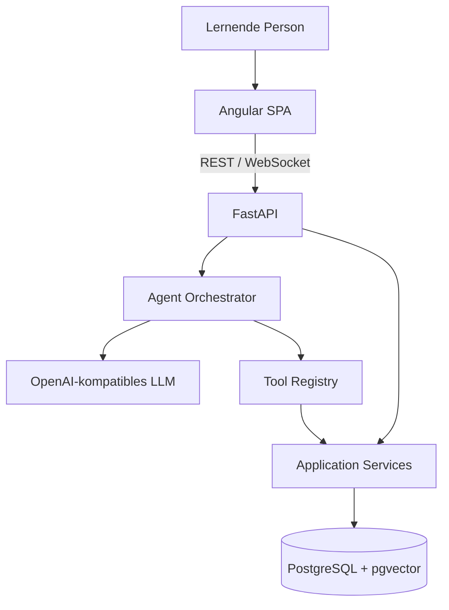
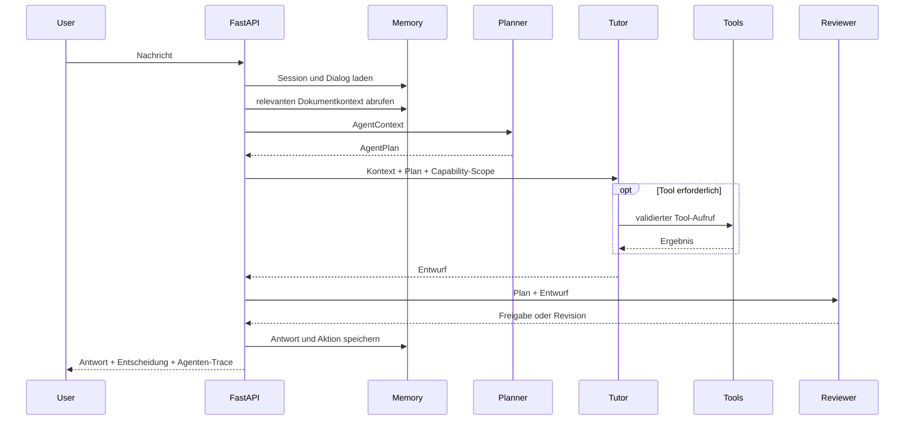

# Technische Architektur

## Systemkontext

StudyMummy besteht aus einem Angular-Client, einer FastAPI-Anwendung und PostgreSQL mit pgvector. Das Backend stellt klassische Anwendungsfunktionen und einen zustandsbehafteten agentischen Tutor bereit.

## Kognitive Schichten

### Perception

Die Wahrnehmungsschicht normalisiert Nutzereingaben und verbindet sie mit dem aktuellen Systemzustand:

- aktuelle Nachricht
- Dialoghistorie
- aktive Aufgabe und Hilfestufe
- expliziter Frontend-Kontext
- semantisch abgerufener Dokumentkontext
- aktuelle Zeit

Dokumentkontext wird ausdrücklich als nicht vertrauenswürdige Quelle markiert. Seine Inhalte dürfen Fachwissen liefern, aber keine Agentenanweisungen verändern.

### Memory

- **Working Memory:** aktuelle Session, Aufgabe, Hilfestufe und Dialog.
- **Episodic Memory:** gespeicherte Chatereignisse, Aufgabenversuche und Resultate.
- **Semantic Memory:** Dokument-Chunks und Embeddings in pgvector.
- **Learning Profile:** Confidence-Werte und wiederkehrende Fehlermuster.

### Planning

Der Planning Agent erzeugt einen `AgentPlan` mit:

- klassifizierter Absicht
- genau einer nächsten Aktion
- beobachtbarem Ziel
- kurzer Entscheidungsgrundlage
- vorgeschlagenen Tools
- prüfbaren Erfolgskriterien

Ein deterministischer Capability-Filter entfernt Tools, die für die gewählte Aktion nicht erlaubt sind. Damit kann ein Modell seine eigenen Rechte nicht erweitern.

### Action

Der Tutor Agent erhält den Plan als verbindlichen Handlungsrahmen. Er antwortet auf Basis des Lernzustands oder ruft registrierte Tools auf. Schreibende Aktionen wie Belohnungen oder Kalendereinträge sind ausschließlich über Tools möglich.

### Review

Der Reviewer Agent kontrolliert die entworfene Antwort unabhängig auf:

- fachliche Plausibilität
- Einhaltung des Plans
- angemessene Hilfestufe
- sokratische Aktivierung
- erfundene Tool-Ausführungen
- Prompt Injection aus Dokumenten

Bei Ablehnung liefert er eine direkt verwendbare Revision. Bei Ausfall des strukturierten Modellaufrufs greift ein sicherer Fallback.

## Ablauf eines Chat-Turns

## Zentrale Implementierungen

| Baustein | Pfad |
|---|---|
| Orchestrierung | `backend/app/agents/orchestrator.py` |
| Agentenprotokoll | `backend/app/agents/protocol.py` |
| Planung | `backend/app/agents/planner.py` |
| Ausführung | `backend/app/agents/tutor.py` |
| Qualitätskontrolle | `backend/app/agents/reviewer.py` |
| LLM-Adapter | `backend/app/services/llm_service.py` |
| Tool Registry | `backend/app/tools/registry.py` |
| Memory Service | `backend/app/services/session_service.py` |
| RAG | `backend/app/services/rag_service.py` |

## Fehler- und Ausfallverhalten

- Ungültige oder zu lange Eingaben werden vor dem Agentenlauf abgelehnt.
- Nicht unterstützter JSON-Modus führt zu einer deterministischen Planung.
- Unbekannte oder nicht erlaubte Tools werden blockiert.
- Fehlerhafte Toolargumente werden als Toolfehler an den Tutor zurückgegeben.
- Ein leerer Tutorentwurf wird durch den Reviewer ersetzt.
- Jeder Lauf besitzt eine Trace-ID und Laufzeiten pro Agentenphase.

## Erweiterungspunkte

Neue Agenten sollten nur ergänzt werden, wenn sie eine eigene Zielsetzung, Ein-/Ausgabeverträge und unabhängige Qualitätskriterien besitzen. Geeignete spätere Rollen wären ein Curriculum Agent für längerfristige Lernpläne oder ein Evidence Agent zur Quellenprüfung. Reine Funktionsaufrufe bleiben Services oder Tools.
